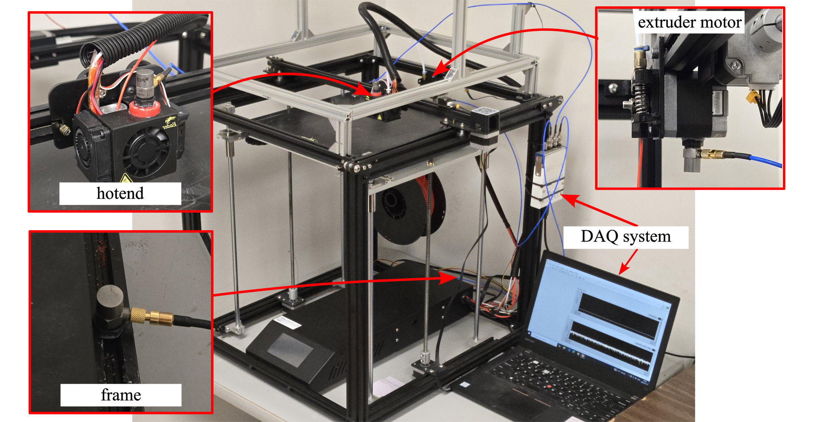
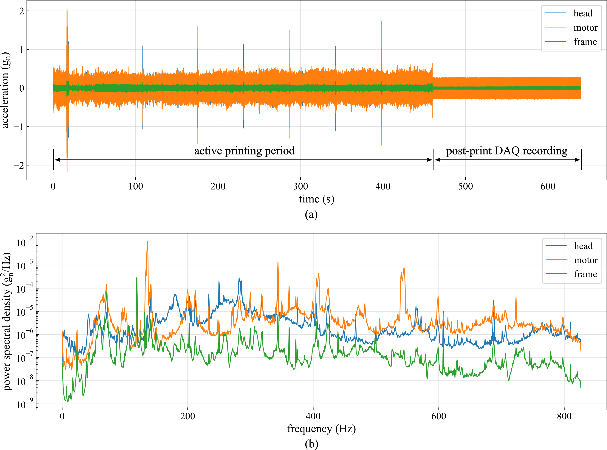

# A 1,600-Hour FFF Printer Vibration Dataset with Three-Point Sensing and Periodic Tensile-to-Failure Testing

This repository holds a long-term, multi-sensor dataset acquired from a single Creality Ender 5 Plus fused filament fabrication (FFF) printer operated for approximately 1,600 hours over roughly 1.5 years. Three accelerometers on the extrusion head, filament-feeding motor, and printer frame recorded vibration at 50 kHz across 15 wear states spanning the full operating life. At each state, five PLA dogbone specimens were printed under fixed process parameters and tensile-tested to failure, giving synchronized machine-condition and part-performance data.

To the authors' knowledge, this is the first publicly available FFF vibration dataset paired with ground-truth tensile measurements across a full service life. It supports condition-based maintenance, wear-progression modeling, transfer learning between short- and long-horizon vibration data, and physics-informed models linking printer health to part strength.

*Figure 1. Experimental setup: accelerometer placement on the extrusion head (hotend), feeding motor, and printer frame, together with the NI 9234 data-acquisition chain.*

*Figure 2. Representative vibration response at wear state 13: (a) time-domain acceleration signals from the extrusion head, motor, and frame sensors at 1,405 cumulative printing hours and (b) corresponding PSD estimated using Welch's method.*

## Repository structure

| Folder | Content | Format | Files |
|---|---|---|---|
| `raw_vibration/` | Raw vibration recordings from the three accelerometers (head, motor, frame), one recording per wear state | `.lvm` | 15 |
| `tensile/` | Raw force–displacement curves from the MTS Exceed E43, five specimens per wear state, plus `tensile_summary.csv` | `.csv` | 75 (+1) |
| `features/` | Extracted 81-feature table and its wear-state-1-normalized version | `.csv` | 2 |
| `maintenance_log/` | Chronological record of maintenance events, process-parameter changes, and excluded intervals | `.csv` | 1 |
| `scripts/` | Python scripts to read `.lvm` files, extract features, and reproduce the figures | `.py` | 2 |

## Vibration data (`raw_vibration/`)

Signals were acquired at 50,000 samples per second with three PCB Piezotronics Model 352A92 ICP accelerometers, an NI 9234 IEPE module, and an NI cDAQ-9171 chassis, and stored in LabVIEW Measurement (`.lvm`) format. Each file has four columns: a time stamp and three acceleration channels in the order head, motor, frame, in units of *g* (1 *g* = 9.80665 m/s²). Each recording covers one full print (~600 s); the first 20 s of every recording is discarded before feature extraction to remove sensor and signal-conditioner startup transients.

Files follow `sampleNN.lvm`, where `NN` is the wear-state index (01–15). Cumulative operating hours per state (179–1,537 h) are listed in `tensile_summary.csv`, in `features.csv`, and in the maintenance log.

## Tensile data (`tensile/`)

At each wear state, five PLA dogbone specimens (ASTM D638) were printed under identical conditions and pulled to failure on an MTS Exceed E43 load frame at 5 mm/min, with force and displacement sampled at 50 Hz. Each `.csv` holds displacement (mm), force (N), and time (s). Files follow `sampleNN_specimenK.csv` (`NN` = wear state 01–15, `K` = specimen 1–5).

`tensile_summary.csv` lists, per specimen, the wear-state index, cumulative hours, peak tensile force (N), displacement at peak (mm), and elongation at break (%).

## Feature tables (`features/`)

`features.csv` contains 81 features per wear state — 27 per sensor across three categories:

- **Statistical (11):** mean, standard deviation, variance, minimum, maximum, range, median, interquartile range, mean absolute deviation, skewness, excess kurtosis.
- **Time-series / signal-shape (8):** RMS, peak, peak-to-peak, absolute mean, crest factor, shape factor, impulse factor, clearance factor.
- **Frequency-domain (8):** peak frequency, peak amplitude, spectral centroid, spectral spread, spectral skewness, spectral kurtosis, band power 0–100 Hz, band power 100–500 Hz.

`features_normalized.csv` holds the same features divided by their wear-state-1 value. Columns are named `{sensor}_{feature}` with `{sensor} ∈ {Head, Motor, Frame}`; columns for the wear-state index, cumulative hours, and mean peak tensile force are also included to support regression. Columns whose wear-state-1 value is zero yield `NaN` in the normalized file and should be read from `features.csv`.

## Process-parameter change between samples 11 and 12

Between roughly 851 and 1,248 cumulative hours the printer ran a 0.6 mm nozzle rather than the 0.4 mm nozzle used for the rest of the study. Because nozzle diameter changes the vibration signature, that interval is excluded to keep a single process configuration; the curated dataset documents only 0.4 mm operation. Sample 12 (1,334 h) is the first recording after reverting to 0.4 mm, which is why cumulative time jumps between samples 11 and 12. `maintenance_log/maintenance_log.csv` is the authoritative event timeline (nine columns: event ID, ISO 8601 date, cumulative hours, event type, original session index 1–23, curated wear-state index 1–15, active nozzle diameter, included flag, and description).

## Scripts (`scripts/`)

- `extract_features.py` — reads the `.lvm` recordings and writes `features.csv` and `features_normalized.csv`.
- `plot_features.py` — regenerates the dataset figures from the feature tables.

## Citation

If you use this dataset, please cite the accompanying Data in Brief article (Fu et al., 2026) and this repository. 

## License

[![CC BY-SA 4.0][cc-by-sa-shield]][cc-by-sa]

This work is licensed under a
[Creative Commons Attribution-ShareAlike 4.0 International License][cc-by-sa].

[cc-by-sa]: http://creativecommons.org/licenses/by-sa/4.0/
[cc-by-sa-image]: https://licensebuttons.net/l/by-sa/4.0/88x31.png
[cc-by-sa-shield]: https://img.shields.io/badge/License-CC%20BY--SA%204.0-lightgrey.svg

## Acknowledgments

Collected at the ARTS Laboratory, Department of Mechanical Engineering, University of South Carolina, Columbia, SC.